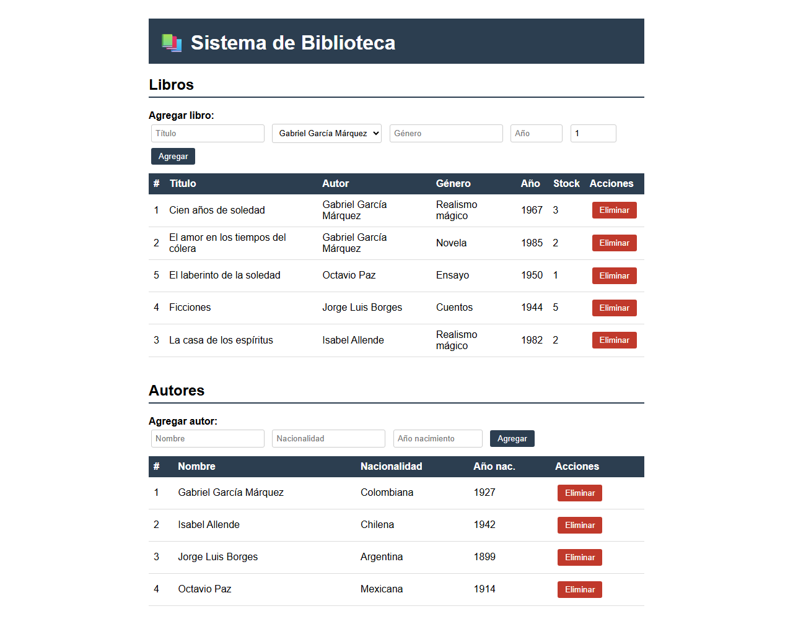

# API REST Biblioteca

Proyecto final de la materia de **Desarrollo de Sistemas IV**.

API REST para la gestión de una biblioteca, construida con **Flask** y **SQLite**. Incluye una interfaz web sencilla para administrar autores, libros y préstamos.

## Captura



## Descripción general

El sistema expone una API REST y una página web desde la que se realizan operaciones **CRUD** sobre tres entidades:

- **Autores**: alta, consulta, actualización y eliminación.
- **Libros**: gestión con control de *stock*, ISBN único y relación con su autor.
- **Préstamos**: registro de préstamos por lector; al prestar un libro se descuenta el stock y al marcarlo como devuelto se repone automáticamente.

Incluye validaciones de datos, manejo de errores con códigos HTTP y datos de ejemplo que se cargan automáticamente la primera vez que se inicializa la base de datos.

## Tecnologías y lenguajes

| Área | Tecnología |
|------|------------|
| Lenguaje | **Python 3** |
| Framework web | **Flask** |
| Base de datos | **SQLite** (`sqlite3`) |
| Frontend | **HTML5**, **CSS** y **JavaScript** (vanilla, `fetch`) |
| Plantillas | **Jinja2** (`templates/index.html`) |

## Endpoints principales

| Método | Ruta | Descripción |
|--------|------|-------------|
| GET | `/` | Interfaz web |
| GET/POST | `/autores` | Listar / crear autores |
| GET/PUT/DELETE | `/autores/<id>` | Consultar / actualizar / eliminar autor |
| GET/POST | `/libros` | Listar / crear libros |
| GET/PUT/DELETE | `/libros/<id>` | Consultar / actualizar / eliminar libro |
| GET/POST | `/prestamos` | Listar / crear préstamos |
| GET/PUT/DELETE | `/prestamos/<id>` | Consultar / actualizar / eliminar préstamo |

## Requerimientos

- Python 3
- Flask

## Instalación y ejecución

```bash
pip install flask
python app.py
```

La aplicación se ejecuta en `http://localhost:5000` y crea/actualiza la base de datos `biblioteca.db` automáticamente.

## Estructura del proyecto

```
.
├── app.py              # API REST y lógica de negocio (Flask + SQLite)
├── biblioteca.db       # Base de datos SQLite
└── templates/
    └── index.html      # Interfaz web (HTML, CSS y JavaScript)
```
